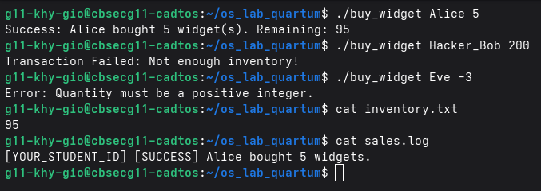

# os-lab-quartum-IDTB110319
## Level 2 - Observation Checkpoint 1

Commands run:
- buy_widget Alice 5      → Success, bought 5 widgets
- buy_widget Hacker_Bob 200 → Failed, not enough inventory
- buy_widget Eve -3       → Rejected, invalid input

inventory.txt result: 95 (100 - 5 = 95)
sales.log result: Only 1 entry (Alice), proving invalid transactions are never logged.

