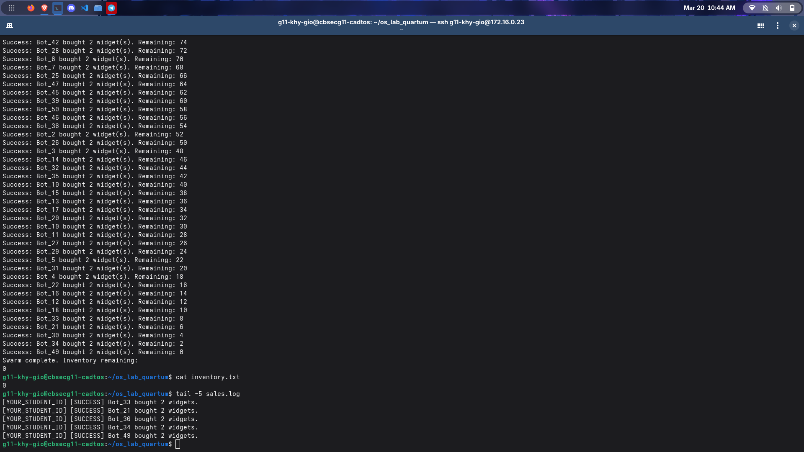
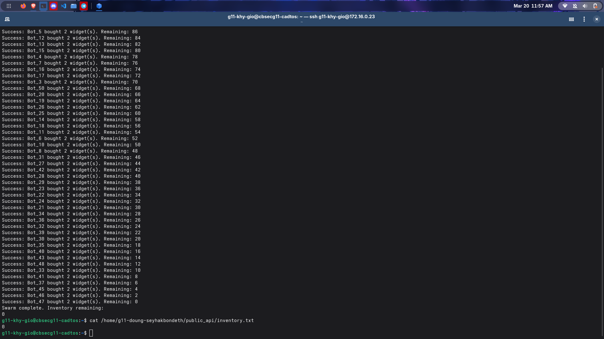

# os-lab-quartum-IDTB110319
## Level 2 - Observation Checkpoint 1

Commands run:
- buy_widget Alice 5      → Success, bought 5 widgets
- buy_widget Hacker_Bob 200 → Failed, not enough inventory
- buy_widget Eve -3       → Rejected, invalid input

inventory.txt result: 95 (100 - 5 = 95)
sales.log result: Only 1 entry (Alice), proving invalid transactions are never logged.

## Level 3 - Observation Checkpoint 2

Run Results:
- Run 1: 84
- Run 2: 78
- Run 3: 80
- Run 4: 82
- Run 5: 88

The inventory never reached 0. Each run produced a different incorrect
result, proving a TOC-TOU race condition exists in the unpatched script.

## Level 4 - Observation Checkpoint 3

After implementing flock mutex:
- inventory.txt result: 0 ✅ (exactly 0, patch successful)
- sales.log shows exactly 50 entries, one per bot

The flock command forces each process to wait its turn before entering
the critical section. No two processes can read/write inventory.txt at
the same time, eliminating the race condition entirely.

## Level 5 - Observation Checkpoint 4

Red Team vs Blue Team Results:
- Partner's username: [partner name]
- My inventory.txt result: 0 ✅
- sales.log shows bot entries from my partner's swarm

The mutex held up against an external user. Even though the bots were
running from a different user account, flock still enforced the lock at
the OS level — proving the protection works across users, not just
within the same account.

